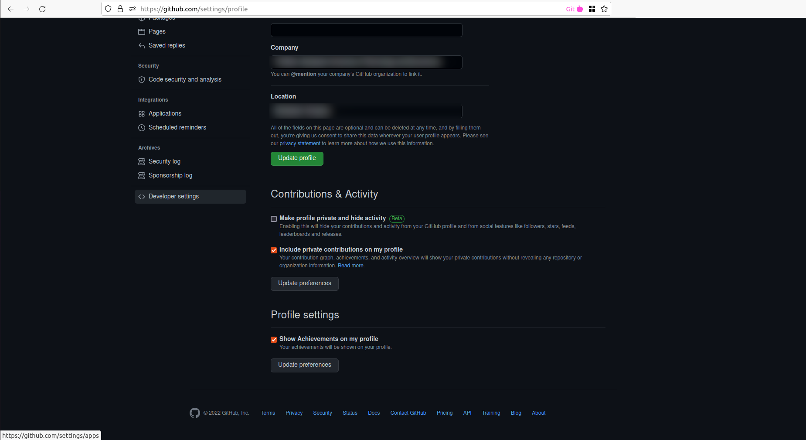
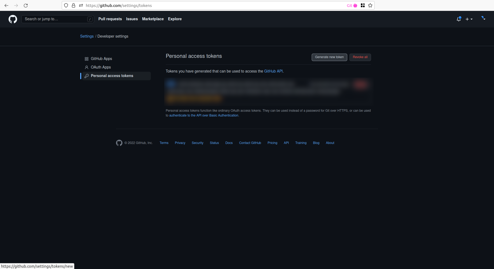
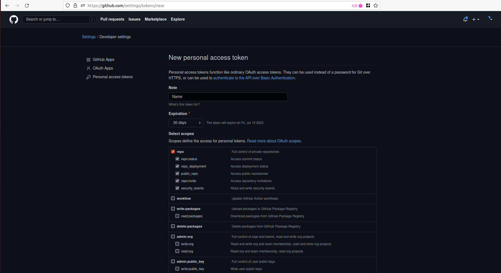
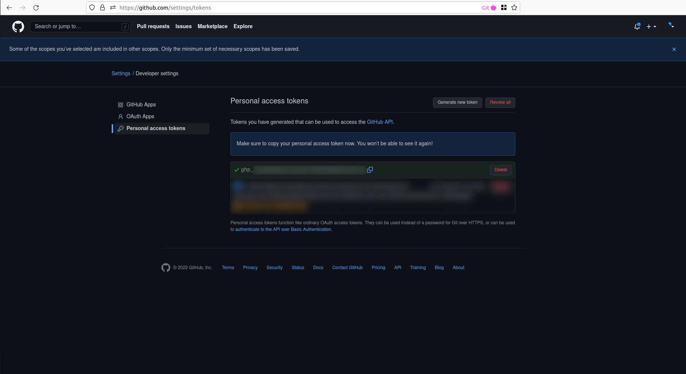
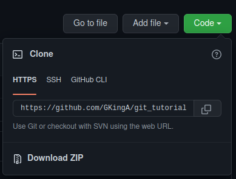

# Personal Access Token

Click on your profile in the upper righ corner and go to the settings option.


It will open up your public profile. You should see a menu on the left side. Scroll down to the last element of the menu, which is the __Developer settings__ and click on it.



In the developer settings click on the __Personal access tokens__ on the menu.



Create a new token by clicking on the __Generate new token__ button.

Here you should name your token however you would like, set up an expiration date and grant access to functions. You should grant access to the repo, because than you can use the token to push to repositories you have access to.



At the end of this page click on the __Generate token__ button. Now you are returned to the previous page and you see a string under your tokens. This is the generated token. You should save this string somewhere on this computer as you won't ba able to access it later.



## Using HTTPS

Once you have your personal access token all set up, you can clone any repository you have access to using HTTPS.

Navigate to a repository you like and click on the __Clone__ button. You should see three options for cloning: HTTPS, SSH, and GitHub CLI. Choose HTTPS and copy the URL.



Paste the copied URL into a Terminal (or Command Prompt or Git Bash) the following way:

```bash
git clone https://{personal_access_token_string}@github.com/{username}/{repository_name}.git
```

Where {username} is the owner of the repository, {repository_name} is the name and the {personal_access_token_string} is the token you just created.

If you've cloned the repository without injecting your personal access token in the URL, you can also set it up using the following command:

```bash
git remote set-url origin https://{personal_access_token_string}@github.com/{username}/{repository_name}.git
```

*Note: If you are trying to clone a private repository this way, you have to inject the personal access token into the URL while cloning, otherwise the process will fail.*
